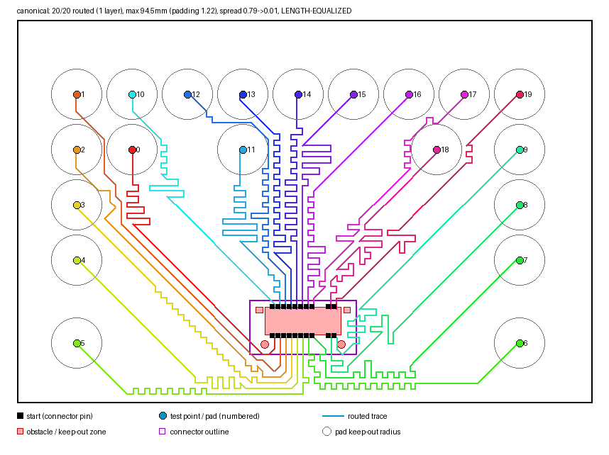

# World-Model-Based Test Point Placement for SI Fixture Routing


DreamerV3 learns where to place test points on a PCB test fixture; a deterministic
octilinear (45°) A* router with negotiated rip-up-and-reroute then routes every
trace and equalizes lengths with serpentine meanders. Placement is the only
learned stage; routing and length equalization are deterministic and planar by
construction (no crossings, full 1.33 mm pitch, pad keep-outs enforced).

**Canonical result:** the TE AutoLayout Example01 board (135×90 mm, 20 traces,
`AutoLayout_Example01.xlsx`) routes **20/20 on a single copper layer, 20/20
length-matched** (spread 0.014) under a 5.98 mm pad keep-out, in ~1 s.
Figures for this and other boards: [`eval_results/equalized/`](eval_results/equalized/).



## Layout

- `envs/` - PCB environment: board loading/placement, router, length equalization, visualization
- `dreamerv3/` - forked DreamerV3 engine
- `scripts/` - `route_canonical.py` (reproduce the canonical result), `board_gallery.py` (figure gallery), `train_ordering.py` (net-ordering model, `models/ordering.npz`)
- `train.py` / `train_ppo.py` / `eval.py` - training and evaluation entry points
- `tests/` - unit tests (run in CI on every push)

## Quickstart

```bash
pip install -r requirements.txt

python -m pytest tests/ -q                              # unit tests
python eval.py --episodes 5 --num_traces 20 --no-plot   # baseline metrics
python scripts/route_canonical.py --mirror --figs       # canonical 20/20 board

python train.py --configs defaults --device cuda:0 --num_traces 20   # train Dreamer
python train_ppo.py --steps 200000 --num_traces 8                    # PPO baseline
```
