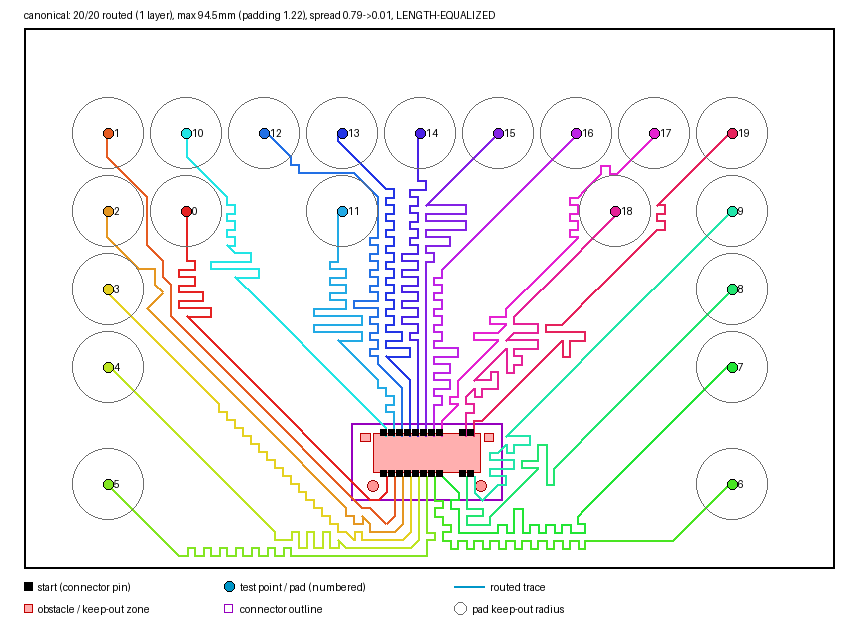

# World-Model-Based Test Point Placement for SI Fixture Routing


DreamerV3 learns test point placement on a PCB test fixture; a deterministic
octilinear A* router routes every trace and equalizes lengths with serpentine
meanders. Placement is the only learned stage.

Canonical result: the TE AutoLayout Example01 board (135x90mm, 20 traces)
routes 20/20 on a single copper layer, 20/20 length-matched, in ~1s.



## Layout

- `envs/` board loading, placement env, router, equalization
- `dreamerv3/` forked DreamerV3 engine
- `scripts/` placement search (`optimize_placement.py`, `wm_guided_search.py`), canonical repro, figures
- `train.py` / `eval.py` training and evaluation
- `pcb_router_colab-v4.ipynb` Colab workflow (training, search, wm-guided search)

## Quickstart

```bash
pip install -r requirements.txt
python -m pytest tests/ -q
python eval.py --episodes 5 --num_traces 20 --no-plot
python scripts/route_canonical.py --mirror --figs
python train.py --configs defaults --device cuda:0 --num_traces 20 --boards canonical
python scripts/optimize_placement.py --board canonical --minutes 10
python scripts/wm_guided_search.py --checkpoint <run>/latest.pt --minutes 10
```
